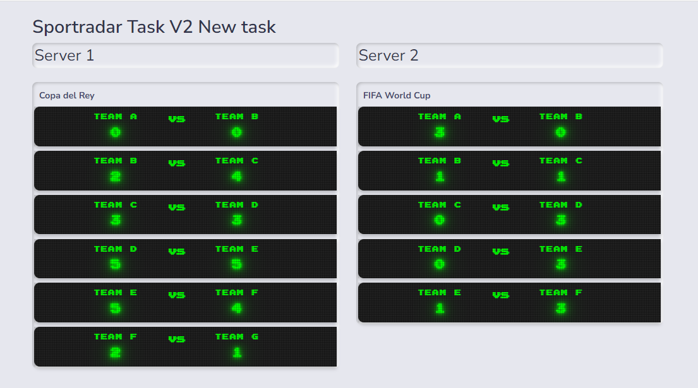

## SportRadar Task v2 (Coding Challenge)

## Screenshot:

### Technologies used in Backend
- **[PHP](https://php.net/)**
- **[Laravel](https://laravel.com/)**
- **[Docker](https://docker.com/)**
- **[Nginx](https://www.nginx.com/)**

### Technologies used in Frontend
- **[ReactJs](https://reactjs.org/)**
- **[Redux](https://redux.js.org/)**
- **[Redux-toolkit](https://redux-toolkit.js.org/)**
- **[Typescript](https://www.typescriptlang.org/)**
- **[redux-persist](https://www.npmjs.com/package/redux-persist)**
  
  
  # How to run backend
  clone 
  https://github.com/ashraf-alsamman/sportradar-backend

- run docker
  `docker-compose build `
  `docker-compose up`
# How to run frontend
  clone 
  https://github.com/ashraf-alsamman/sportradar

- Run frontend (react js) project
  `npm install`
  `npm start`
  
  - Run tests
  `npm test`

 

 

 
